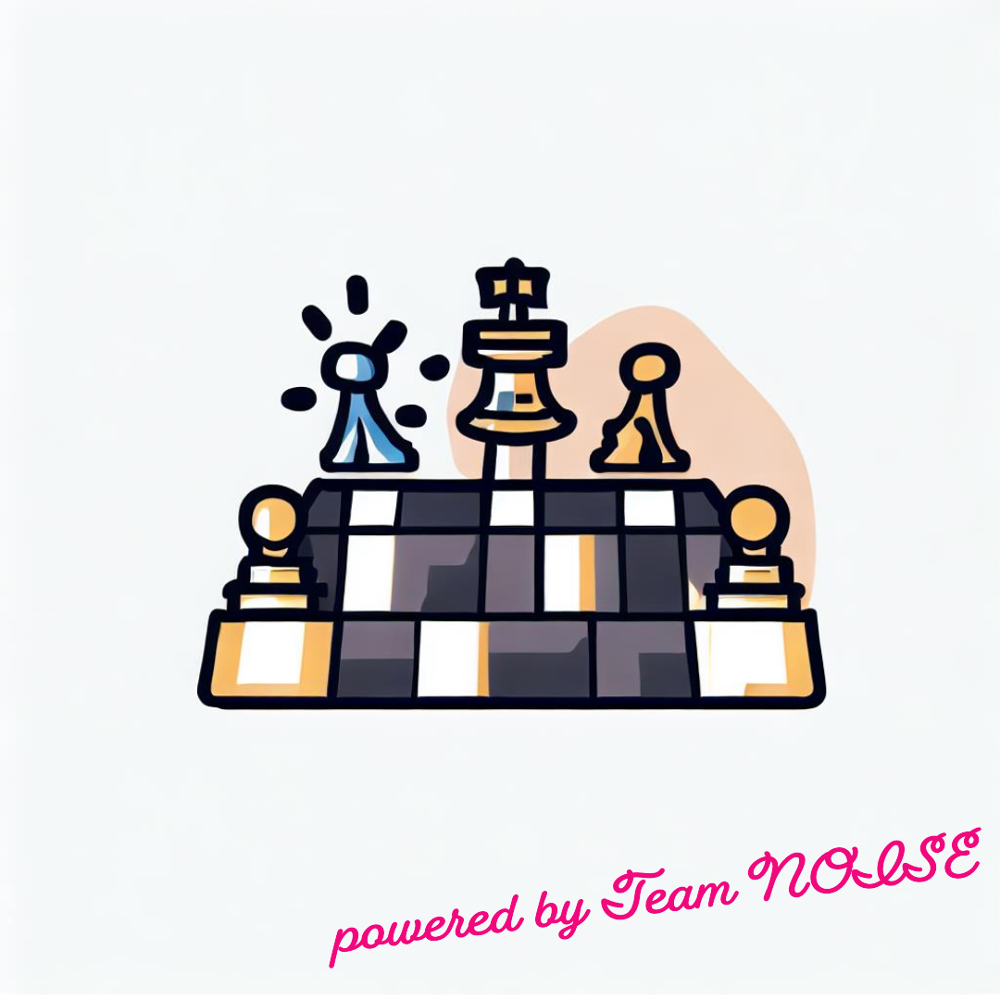

<p align="center">
    
</p>

# noisy-chess-game
Team NOISEでオリジナルのチェスゲームを作成するためのリポジトリ   

# 概要
GUIで遊べるチェスゲームのコア機能とその周辺機能の実装  
[Option] Serverでサービス提供するかは要検討

## 機能
* 一般的なチェスゲーム
* 独自ルールを追加したチェスゲーム

## 起動方法
ソースコードのビルド
```
mvn clean package
```

アプリケーションの実行
```
java -jar <artifact>.jar
```


### contributors
@noritaka-kagei, @takefujiacom
